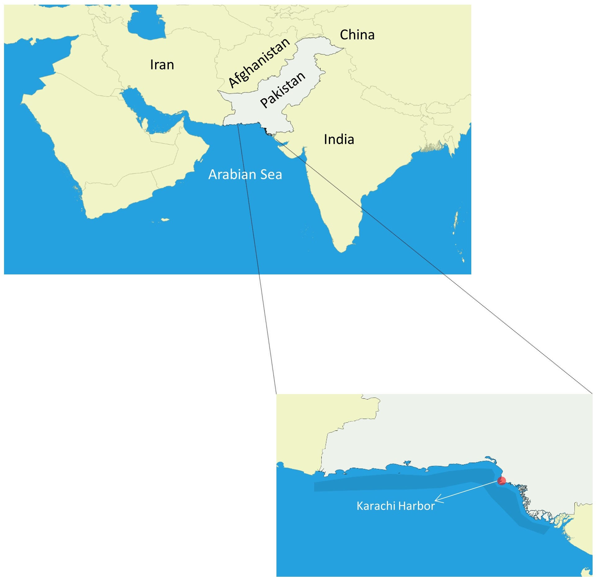
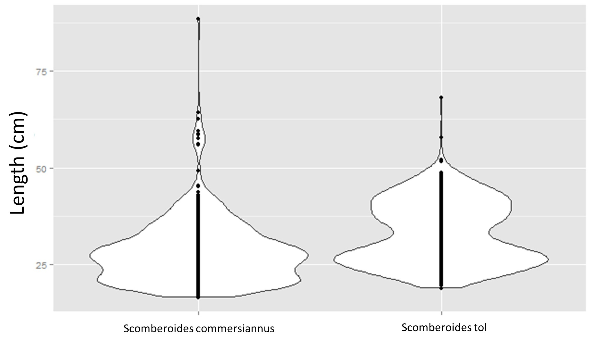
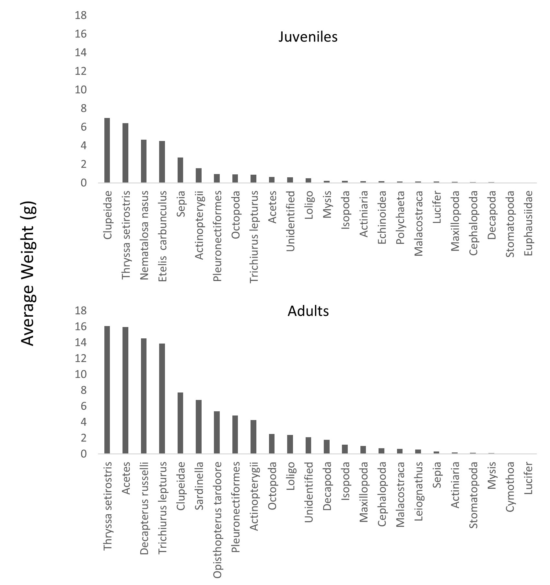
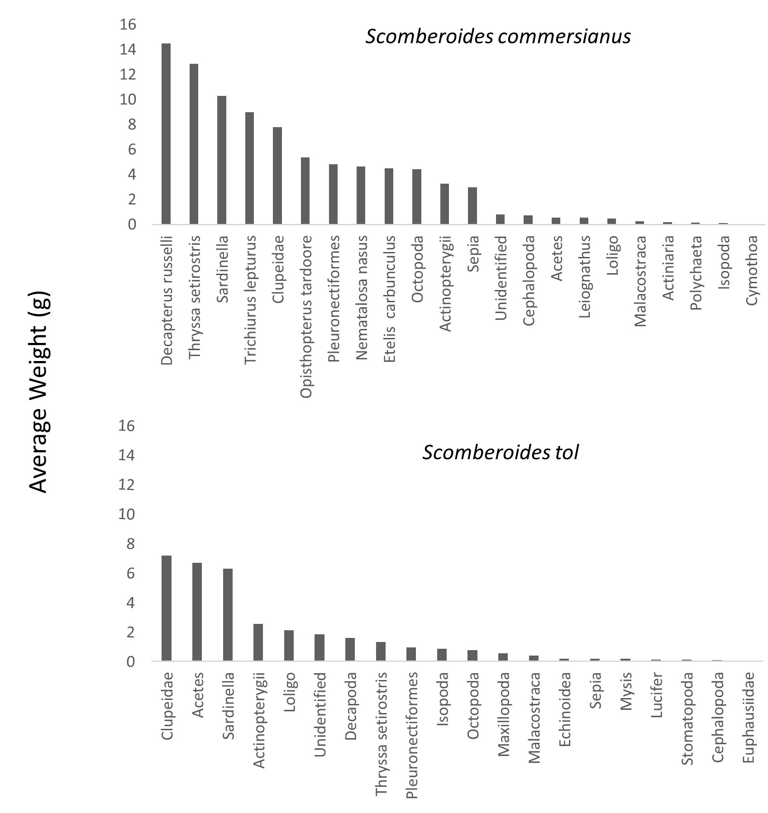
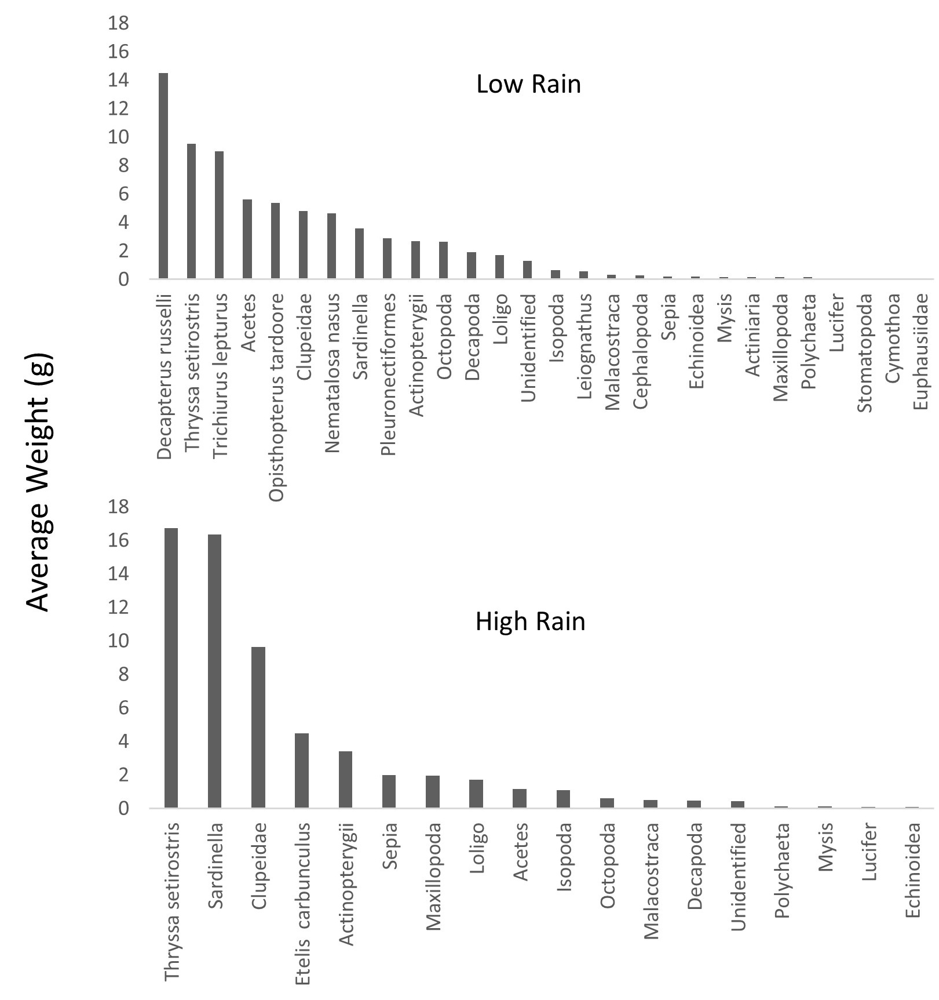
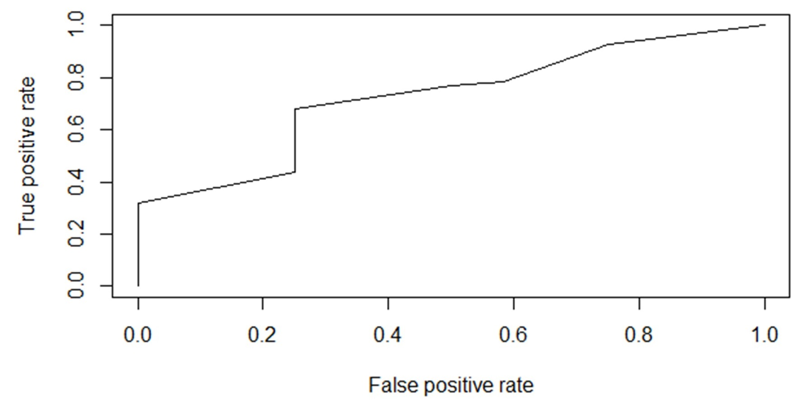

# Feeding patterns in two commercially important species of fish from the northern Arabian Sea coast of Pakistan

## Highlights
This project was conducted in collaboration with scientists from Pakistan and myself. The need for investigating feeding patterns of the target study species is underscored by the overfishing status of them. To manage the species in the proper manner, their interactions with other prey species needed to be uncovered. We conducted a multivariate statistical analysis to find patterns in what the species ate, including when and the influence of environmental factors in feeding success. Below is the abstract of a publication coming out of the project and some visuals for depicting the results.

The following tools and analysis were used in this project:
- R for inferential statistics and visualizations
- SQL Server for data storage
- Permutational analysis of variance was the main analytical approach

## Abstract and Visuals
Port landing of _Scomberoides commersonnianus_ and _S. tol_ were obtained between July 2013 and June 2015 for stomach content analysis. Analysis of prey composition was done using permutational analysis of variance (permanova), with species, life stage (juvenile and adults), gender, and weather (rainy and dry season) as factors. Patterns of empty stomachs were investigated to estimate feeding intensity. Feeding intensity was estimated with logistic regression, using the same independent variables as above. Prey importance was also investigated. Prey importance was assessed using a Wilcox Rank Correlation analysis on the Index of Relative Importance (IRI) by species and life-stage. Permanova analysis showed that fish was the most important dietary item for juveniles and adults. Adults secondarily preferred crustaceans. Fish was predominant for _S. commersonnianus_ and crustaceans, especially of the genus Acetes sp., was equally important for S. tol. Acetes sp. was more important during the dry season for both, _S. commersonnianus_ and _S. tol_. Adults of both species showed a higher feeding activity. The IRI showed fish, followed by crustaceans, to be the most important food item for _S. commersonnianus_ and _S. tol_. This study is to offer baseline data toward implementing a fishery in Pakistan for current and future generations.

Figure 1. Study area of feeding patterns of Scomberoides commersiannus and S. tol; shaded area along coast indicates location of commercial fishing grounds. 

Figure 2. Violin plot of length distribution of Scomberoides commersoniannus and S. tol sampled along the Pakistani coast.

Figure 3. Average weight of prey items in stomach of juvenile and adult Scomberoides commersoniannus and S. tol sampled from landings in Pakistan between July 2013 and June 2014; data pooled for species. 

Figure 4. Average weight of prey items in stomach of Scomberoides commersoniannus and S. tol sampled from landings in Pakistan between July 2013 and June 2014.
 

Figure 5. Average weight of prey items in stomach of Scomberoides commersoniannus and S. tol by season (rainy and dry) sampled from landings in Pakistan between July 2013 and June 2014; data pooled for species.

Figure 6. Receiver operating characteristic plot indicating performance of binomial logistic regression of stomach emptiness on species, gender, life stage, and weather for Scomberoides commersoniannus and S. tol sampled from landings in Pakistan between July 2013 and June 2014.

